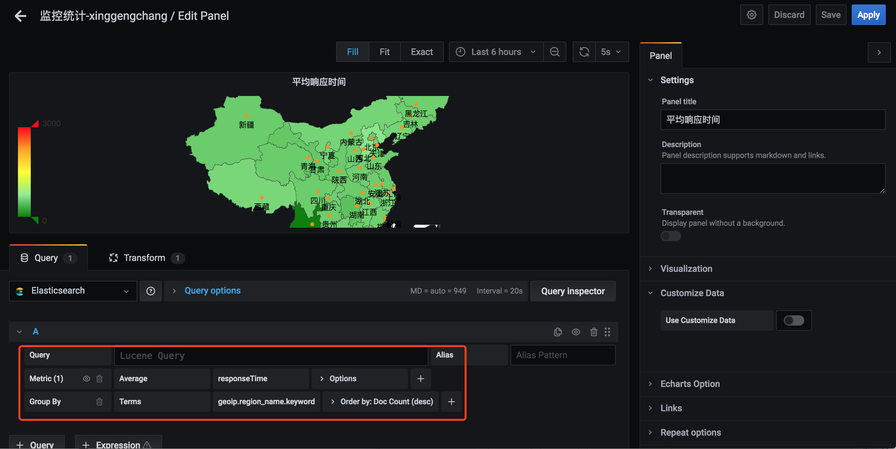
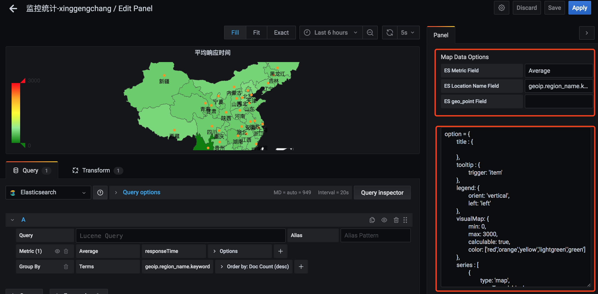
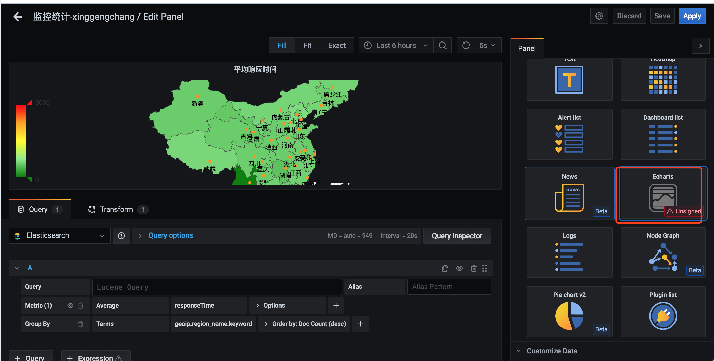

## Echarts Panel Plugin for Grafana

Grafana集成Echarts
Grafana v7.5.4
Echarts v4.0.x

感谢https://github.com/wuyi5630/grafana-echarts-panel 大哥的贡献。
此插件在大哥贡献的基础上做了修改：
	1 支持高版本Grafana,目前支持7.5.4及以上，7以上版本也支持但是没亲试过。
	2 修复了panel保存报错的问题。
	3 ES Location Name Field支持geoip.region_name 英文key，ES geo_point Field 可以不填（wuyi5630贡献有一个bug是Average计算不对，所以针对bug做了修改）

**Metrics**


**Echarts option**

```javascript
option = {
	title : {
	
	},
	tooltip : {
		trigger: 'item'
	},
	legend: {
		orient: 'vertical',
		left: 'left'
	},
	visualMap: {
		min: 0,
		max: 2000,         
		calculable: true,
		color: ['red','orange','yellow','lightgreen','green']
	},
	series : [
		{
			type: 'map',
			mapType: 'china',
			hoverable: true,
			roam:true,
			itemStyle:{
				normal:{label:{show:true}, areaColor: '#edf2f1'},
				emphasis:{label:{show:true}, areaColor: '#06060f'}
			},
			mapLocation: {
				y: "center",
				x: "center",
				height: "320"
			},
			label: {
				normal: {
					show: true
				},
				emphasis: {
					show: true
				}
			},
			data: ctrl.data
		}
	]
};
```
**效果图**


## 插件安装
- 将本实例clone到你的plugins目录后重新启动grafana服务即可
